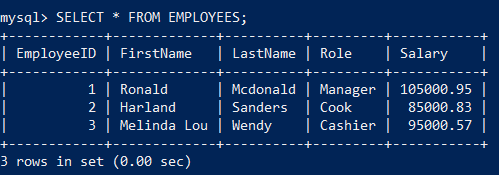

# *SQL*

## 2024-06-21

### Refresher on Subqueries in SQL!

Remember Subqueries are resolved prior to its parent query :)

```
SELECT column_name(s)
FROM table_name1
WHERE expression_operation
(SELECT column name FROM table_name2 WHERE expression_condition); <== Subquery
```

Subquerys can return any of the following:
```markdown
1. Single Value
2. Single Row
3. Single Column
4. Multiple rows (ALL ANY COMPARISON OPERATOR)
```

Example Table Generation:
```sql
CREATE DATABASE IF NOT EXISTS subquery_db;
SHOW DATABASES; --you should see subquery_db

USE subquery_db; --activates as your DB
SHOW TABLES; 
--should be empty, unless you're beyond the creation of the table

CREATE TABLE IF NOT EXISTS Employees
(
    EmployeeID INT PRIMARY KEY AUTO_INCREMENT, 
    FirstName VARCHAR(100) NOT NULL, 
    LastName VARCHAR(100) NOT NULL, 
    Role VARCHAR(50) NOT NULL,
    Salary DECIMAL(8,2)
);

SHOW COLUMNS FROM EMPLOYEES;
-- check that your created table have the correct columns :)

INSERT INTO Employees (FirstName, LastName, Role, Salary) 
VALUES 
('Ronald', 'Mcdonald', 'Manager', 105000.95),
('Harland', 'Sanders', 'Cook', 85000.83),
('Melinda Lou', 'Wendy', 'Cashier', 95000.57);

SELECT * FROM EMPLOYEES; 
--check if it populated if not check your syntax
```



```sql
SELECT * FROM EMPLOYEES; --shown above
/* 
if your table doesn't exist then "you did something wrong :P", check syntax and make sure you iteratively went through everthing :D
*/

--Finally the actual subquery :)
SELECT * 
FROM Employees
WHERE Salary > (SELECT Salary FROM Employees WHERE Role = 'Cook'); -- the subquery in parentheses!

-- Can you infer what this query is actually doing? (solution below)
-- The Subquery will return the Salary where the Role is a Cook, and 
-- if you think about its like this:
(SELECT Salary FROM Employees WHERE Role = 'Cook') = 85000.83

SELECT * 
FROM Employees
WHERE Salary > (85000.83); -- the subquery in parentheses! - this is an example of a single value subquery
```

