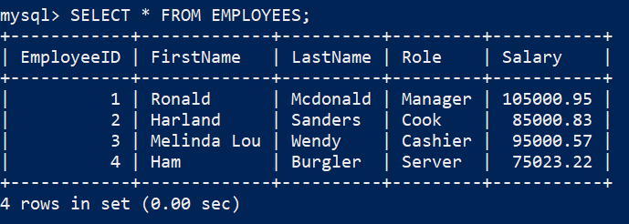
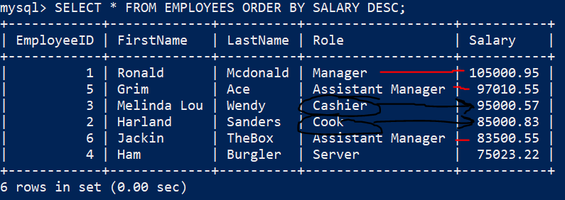
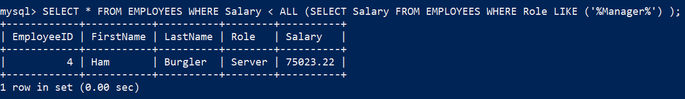

# *SQL*

## 2024-06-21

### Refresher on Subqueries in SQL!

Remember Subqueries are resolved prior to its parent query :)

```
SELECT column_name(s)
FROM table_name1
WHERE expression_operation
(SELECT column name FROM table_name2 WHERE expression_condition); <== Subquery
```

Subquerys can return any of the following:
```markdown
1. Single Value
2. Single Row
3. Single Column
4. Multiple rows (ALL ANY COMPARISON OPERATOR)
```

Example Table Generation:
```sql
CREATE DATABASE IF NOT EXISTS subquery_db;
SHOW DATABASES; --you should see subquery_db

USE subquery_db; --activates as your DB
SHOW TABLES; 
--should be empty, unless you're beyond the creation of the table

CREATE TABLE IF NOT EXISTS Employees
(
    EmployeeID INT PRIMARY KEY AUTO_INCREMENT, 
    FirstName VARCHAR(100) NOT NULL, 
    LastName VARCHAR(100) NOT NULL, 
    Role VARCHAR(50) NOT NULL,
    Salary DECIMAL(8,2)
);

SHOW COLUMNS FROM EMPLOYEES;
-- check that your created table have the correct columns :)

INSERT INTO Employees (FirstName, LastName, Role, Salary) 
VALUES 
('Ronald', 'Mcdonald', 'Manager', 105000.95),
('Harland', 'Sanders', 'Cook', 85000.83),
('Melinda Lou', 'Wendy', 'Cashier', 95000.57);

SELECT * FROM EMPLOYEES; 
--check if it populated if not check your syntax
```


```sql
SELECT * FROM EMPLOYEES; --shown above
/* 
if your table doesn't exist then "you did something wrong :P", check syntax and make sure you iteratively went through everthing :D
*/

--Finally the actual subquery :)
SELECT * 
FROM Employees
WHERE Salary > (SELECT Salary FROM Employees WHERE Role = 'Cook'); -- the subquery in parentheses!

-- Can you infer what this query is actually doing? (solution below)
-- The Subquery will return the Salary where the Role is a Cook, and 
-- if you think about its like this:
(SELECT Salary FROM Employees WHERE Role = 'Cook') = 85000.83

SELECT * 
FROM Employees
WHERE Salary > (85000.83); -- the subquery in parentheses! - this is an example of a single value subquery
```

Lets spice things up with "_*ALL*_" SubQuery!
Suppose you want to get the list of Salaries that are not managerial roles. \
(hopefully they're getting a promotion :D or maybe you're just calculating operations costs :P)

```sql
--Lets add one more entry to make the visualization easier.

INSERT INTO Employees (FirstName, LastName, Role, Salary) 
VALUES 
('Ham', 'Burgler', 'Server', 75023.22);
('Grim', 'Ace', 'Assistant Manager', 97010.55)
```


This should be your new Employees Table :)

Now using the ALL operator in a subquery we want to get all salaries that are not Managers or Assistant Managers! \
Try to figure it out on your own, or you can just look at the code block :P


```
--There's more than one way of doing this but this is the one used for this example:
SELECT * 
FROM EMPLOYEES 
WHERE Salary < ALL (
    SELECT Salary FROM EMPLOYEES WHERE Role LIKE ('%Manager%') 
);
--This does the job however introduces possible error in the future. Can you see it?
--What if more managers or assistant managers are added to this table and they have lower salaries than some non-managers?

-- Can you construct a query that will handle this case since we originally sought to get salaries lower than managers?

-- Use this additional example to see the issue
INSERT INTO Employees (FirstName, LastName, Role, Salary) 
VALUES 
('Jackin', 'TheBox', 'Assistant Manager', 83500.55);

```



As you can see the lines in red by the role row/column shows that there exists an assistant manager \
having lower salary than Employee 3 (Wendy) and 2 (Sanders).

 Now running the Query at Above 
 ```
SELECT * 
FROM EMPLOYEES 
WHERE Salary < ALL (
    SELECT Salary FROM EMPLOYEES WHERE Role LIKE ('%Manager%') 
);
 ```
give us us the "wrong intention result" :

 

 We're missing Wendy and Sanders! :(

Try constructing a query that will fix this and try to make it solve the most generic cases, \
but not always the queries will always work. :D \
You're free to construct the query as any way you want you don't have to use subqueries or ALL.

Answer Below:
```
SELECT * FROM Employees WHERE Role NOT LIKE '%Manager';

--Sometimes the most obvious solutions are the best solutions :D, KISS - Keep it Simple Superstar! 
--(changed stu*** to superstar :P)
--Remember the more complex something becomes should be a warning of a detailed missed or omited
--Doesn't mean its necessary or wrong for it to be complex, something are just inherently unintuitive - for example topology of dimensions (can you imagine 4th, 5th, + dimensions? haha)

```